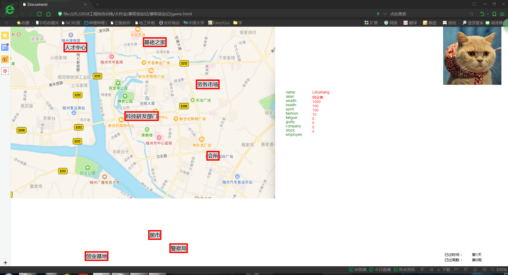

# **康哥创业记**
## 目录  
* [背景](#背景)  
* [游戏介绍](#游戏介绍)  
* [使用说明](#使用说明)  
* [作者](#作者)
* [开发环境](#开发环境)

## 背景  
由电气学院暑期软件工程训练营提出，我们团队合作完成的项目

## 游戏介绍    
这是个由JavaScript编写，在网页上运行的模拟经营类文字游戏。游戏模拟了李睿康从零开始的创业过程。根据不同的选择会有多种结局等待玩家的发掘，同时也有诙谐的吐槽文案增添游戏趣味。*游戏中的各事件项目均为凭空构架，以娱乐为主要目的，与现实无任何联系。*

## 使用说明 
在文件夹中点击下图图标即可打开网页开始游戏  
   
进入游戏后便能看到如下界面  
  
点击相应地点便能查看并进行相关操作，通过不断的进行事件来积累财富，不断地朝着成功的企业家迈进。

# 作者
李睿康  周兆伟  张仕博  李越
# 开发环境
使用Visual Studio，使用js语言开发
